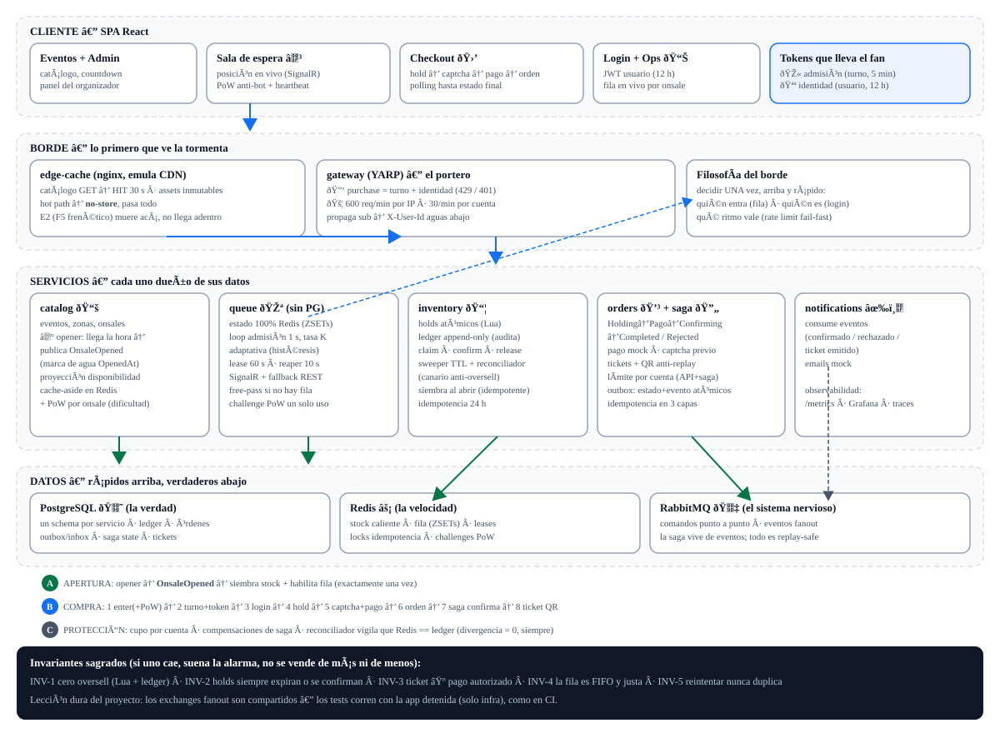

# TicketNow

Plataforma didáctica de venta de entradas para eventos y recitales, diseñada para sobrevivir al escenario "se abre la venta de un recital gigante y explota la demanda": decenas de miles de personas intentando comprar en el mismo segundo.

> **Objetivo del proyecto:** aplicar, en un caso lo más cercano posible a producción, los patrones que usan los sistemas de ticketing reales: fila virtual (waiting room), reservas atómicas de inventario, sagas distribuidas, outbox transaccional, control de admisión, backpressure y observabilidad de extremo a extremo.

## Mapa del sistema



> [Versión completa con explicación](https://fedesauzzadev.github.io/TicketNow/mapa-del-sistema.html) (GitHub Pages) · La idea central: **la tormenta se ordena en la puerta; adentro, todo es contado o compensado.**

## Stack

| Capa | Tecnología |
|---|---|
| Backend | .NET 8 (ASP.NET Core Minimal APIs, EF Core, MassTransit) |
| Frontend | React + Vite + TypeScript (TanStack Query, Zustand, SignalR) |
| Datos | PostgreSQL (source of truth) · Redis (hot path) |
| Mensajería | RabbitMQ |
| Edge / Gateway | YARP |
| Observabilidad | OpenTelemetry · Prometheus · Grafana · Jaeger |
| Infraestructura | Docker / Docker Compose |
| Pruebas de carga | k6 · NBomber |

## Documentación (SDD)

| Documento | Contenido |
|---|---|
| [docs/SDD.md](docs/SDD.md) | Portada, resumen ejecutivo, decisiones clave, roadmap, riesgos y glosario |
| [docs/01-vision-y-requisitos.md](docs/01-vision-y-requisitos.md) | Visión, personas, alcance, requisitos funcionales y no funcionales, escenarios de carga |
| [docs/02-arquitectura.md](docs/02-arquitectura.md) | Principios de diseño, C4, catálogo de servicios, flujo crítico, topología de mensajería, ADRs |
| [docs/03-patrones.md](docs/03-patrones.md) | Los 12 patrones aplicados, con justificación, snippets y modo de falla sin cada patrón |
| [docs/04-datos-y-apis.md](docs/04-datos-y-apis.md) | Ownership de datos, modelo PostgreSQL, keyspace Redis, contratos REST y SignalR |
| [docs/05-despliegue-y-observabilidad.md](docs/05-despliegue-y-observabilidad.md) | Docker Compose, CI/CD, métricas, alertas, pruebas de carga y caos |
| [docs/06-seguridad.md](docs/06-seguridad.md) | Modelo de amenazas, autenticación, pagos, entradas QR, OWASP |

## Estructura

```text
src/
  Gateway/               # YARP: routing, rate limiting, admission token (Fase 4)
  QueueService/          # Fila virtual + SignalR (Fase 4)
  CatalogService/        # Eventos/zonas + cache-aside (Fase 1)
  InventoryService/      # Holds atómicos (Lua) + ledger + sweeper (Fase 2)
  OrdersService/         # Checkout + saga MassTransit + pagos mock (Fase 3)
  NotificationsService/  # Consumidor de eventos (Fase 3)
  BuildingBlocks/TicketNow.ServiceDefaults/  # Serilog + OTel + health checks
  Contracts/TicketNow.Contracts/             # Eventos de dominio (POCOs)
  spa/                   # Placeholder Fase 0 (la app Vite llega en Fase 1)
deploy/                  # nginx edge-cache, prometheus, grafana, init PG
tests/
docker-compose.yml
```

## Quickstart

```bash
cp .env.example .env            # Windows: copy .env.example .env
docker compose up -d --build    # stack base (10 contenedores)
docker compose --profile obs up -d   # + Prometheus :9091, Grafana :3001, Jaeger :16686
```

- App (smoke test visual): <http://localhost:8090>
- RabbitMQ management: <http://localhost:15673> (ticketnow / tu password del .env)
- Grafana: <http://localhost:3001> (admin) · Jaeger: <http://localhost:16686>
- Puertos host (configurables en `.env`): edge 8090 · PG 5435 · Redis 6382 · Rabbit 5673/15673

```bash
dotnet build -c Release && dotnet test -c Release --no-build   # CI local
docker compose down             # apagar (agregá -v para borrar volúmenes)
```

> **Tests e2e y red Docker:** los tests de checkout usan PG/RabbitMQ/Redis reales.
> En host (Windows) necesitan el compose con infra arriba + estas env vars
> (ver [docs/05 §5.1bis](docs/05-despliegue-y-observabilidad.md) para el porqué):
>
> ```powershell
> $env:TICKETNOW_TEST_POSTGRES = "Host=localhost;Port=5435;Database=ticketnow;Username=ticketnow;Password=ticketnow"
> $env:TICKETNOW_TEST_RABBITMQ_PORT = "5673"
> $env:TICKETNOW_TEST_RABBITMQ_USER = "ticketnow"
> $env:TICKETNOW_TEST_RABBITMQ_PASS = "ticketnow"
> dotnet test -c Release
> ```
>
> Para una corrida 100% hermética (sin port-forward de por medio):
> `docker compose --profile test run --rm test-runner`.

## Estado

**Fase 0 — Fundación: COMPLETADA** (ver [roadmap](docs/SDD.md#7-roadmap)).

- Solución .NET 8: 6 servicios + ServiceDefaults + Contracts + tests (CPM).
- Docker Compose: 11 contenedores con healthchecks verdes; smoke test e2e vía edge-cache OK.
- Edge-cache (CDN emulado) verificado: `X-Cache-Status: MISS → HIT` en catálogo y assets; hot path `no-store`.
- CI de GitHub Actions (build + test + validación de compose).

**Fase 1 — Catálogo: COMPLETADA.**

- `catalog-service`: EF Core + schema `catalog` (venues/events/zones/onsales) con migración y seed; lecturas con cache-aside en Redis (single-flight, TTL 60 s, invalidación por SCAN); CRUD admin (sin auth hasta Fase 6); respuestas `problem+json`; `Cache-Control` para el borde.
- SPA React + Vite + TS: listado con búsqueda (TanStack Query), detalle con zonas + countdown al onsale, panel admin; assets con hash inmutables cacheados 7 d en el edge.
- Tests: 7/7 verdes (integración con InMemory: listado, detalle, 404, flujo admin, validación 400).
- Smoke e2e verificado: listado seed, `MISS → HIT` en catálogo y assets, búsqueda, detalle, zonas, creación + onsale vía admin, claves `catalog:*` en Redis e invalidación efectiva.

**Fase 2 — Inventario: COMPLETADA.**

- `inventory-service`: holds atómicos con Lua (`POST /holds` → 201/409), ledger append-only + `holds` audit en schema `inventory`, idempotencia por `Idempotency-Key` (Redis 24 h), liberación voluntaria, seed explícito de stock.
- Sweeper (cada 5 s) + reconciliador (cada 30 s) con política curar-ledger-primero, backstop de vencidos y reparación Redis←ledger + métrica `inventory_divergence_total` (visible en `/metrics`).
- Tests: 13/13 verdes con Testcontainers (Redis real) — 200 concurrentes × 10 unidades = exactamente 10 otorgados (INV-1), release, 409, replay idempotente, reparación y expiración.
- Smoke e2e verificado: seed, hold, replay idéntico, agotamiento 201×3+409, `DELETE` 204, divergencia 999→reparada con métrica, ledger balanceado (7 HOLDs −9 + 1 RELEASE +1).
- Fix transversal: faltaba `MapPrometheusScrapingEndpoint()` — ahora los 6 servicios exponen `/metrics`.

**Fase 3 — Checkout: COMPLETADA.**

- `orders-service`: saga MassTransit (`Holding → AwaitingPayment → Confirming → Completed/Rejected`, con compensaciones e `Ignore` de duplicados), outbox transaccional, pagos mock (latencia/rechazos configurables + tarjeta `0002` de rechazo forzado), tickets con QR JWT-HMAC + verificación anti-replay, `POST /orders` idempotente en 3 capas (clave + lock Redis + UNIQUE) con validación en dos tiempos.
- `inventory-service`: consumers `Validate/Release/ConfirmHold` (puerta autoritativa Lua), claim de holds por orden, publicación de eventos vía outbox.
- `catalog-service`: proyección de disponibilidad event-driven (`high/medium/low/soldout`) + cache Redis con auto-reconexión.
- `notifications-service`: emails mock por eventos.
- Tests: 20/20 (e2e compra/rechazo/expiración/idempotencia/QR + concurrencia + reconciliador + mapping de outbox).
- Smoke e2e en Docker verificado: compra Pending→Confirmed en ~5 s, QR válido→usado, compensación por rechazo, proyección a soldout, emails mock.
- Lecciones registradas: [ADR-009](docs/02-arquitectura.md#adr-009-checkout-asíncrono-con-comando-submitorder--validación-en-dos-tiempos), aislamiento de tests ([docs/05 §5.1bis](docs/05-despliegue-y-observabilidad.md)), MassTransit 8.2.5 (último OSS con EF8).

**Fase 4 — Fila virtual: COMPLETADA.**

- `queue-service`: estado 100% Redis (ZSETs waiting/seen/admitted + sesiones), admission loop 1 s con tasa adaptativa por histéresis (salud del inventario → K/2 o +10%), reaper cada 10 s (gracia 60 s, reingreso conserva el lugar), SignalR `/hubs/queue` (Redis backplane) con posición y admisión por push + fallback REST (`GET /api/queue/me` re-emite el token si ya estás admitido), free-pass para onsales sin fila ([ADR-010](docs/02-arquitectura.md#adr-010-fila-virtual-con-free-pass-configurable-por-onsale)).
- Admission token JWT HS256 (5 min, lease 60 s) emitido por queue-service y exigido por el **gateway** (`X-Admission-Token`) en `/api/inventory|orders|payments|tickets/*` → 429 `admission_required` fuera del admin. La decisión de admisión se toma una sola vez, en el borde.
- Config con precedencia override admin > catálogo (`onsale-config`, caché 30 s, fail-open).
- SPA: store zustand de fila, `QueuePage` (posición/ETA en vivo, heartbeat 30 s, reconexión conserva lugar), token automático en `api.ts`, checkout completo en detalle de evento (hold→pago→orden→polling) con 429→re-encolar.
- Tests: 29/29 (fila FIFO/reingreso/free-pass/tamper/expiración + suite completa previa).
- Smoke e2e en Docker verificado: override requiere-fila → enter ×3 → 429 sin token en holds → admisión (rate 1/s) → token vía `/me` → hold 201 → orden **Confirmed** con ticket; `/hubs/queue/negotiate` 200 con `no-store` por edge.
- Lección clave de tests: los exchanges fanout son **compartidos** entre compose y testhosts — la suite en host requiere la app de compose detenida (solo infra); ver [docs/05 §5.1bis](docs/05-despliegue-y-observabilidad.md).

**Fase 5 — Apertura por evento + carga: COMPLETADA.**

- `OnsaleOpened` (contrato en Contracts): `catalog.Onsale.OpenedAt` como marca de agua; `OnsaleOpenerWorker` (5 s) publica con zonas; `inventory` siembra idempotente (adiós seed manual como camino principal); `queue` habilita la fila y arranca la tasa K en el valor inicial. Replay-safe de punta a punta ([docs/03 §14](docs/03-patrones.md)).
- Migraciones: `AddOpenedAt` (servicio) + `TestInit_OpenedAt` (tests).
- Suite k6 E1–E4 en `load/` (profile `load`, fixtures propias por corrida): E1/E2 al edge (CDN), E3/E4 directo al gateway con XFF por VU. Referencia en laptop: E1 p95 < 1 ms; E3 humo 200 confirmados + 57 rechazados, admisión p95 = 2 s, 0 errores reales; E4 500 vs 10 → exactamente 10 (INV-1).
- Lecciones k6 (reales, encontradas por la suite): `Catalog__BaseUrl`/`Inventory__BaseUrl` faltaban en compose (el queue se llamaba a sí mismo); rate limiter del gateway 100 req/min por IP **del proxy** + cola de espera que aparcaba clientes → ahora `ForwardedHeaders`, 600 req/min por IP real, fail fast (ver [docs/05 §5.2](docs/05-despliegue-y-observabilidad.md) y [docs/06 §3](docs/06-seguridad.md)).
- Tests: 31/31 (apertura→siembra e2e + habilitación de fila por bus).
- Smoke e2e en Docker verificado: evento abierto solo por el worker → stock sembrado → fila habilitada → compra **Confirmed**.

**Fase 6 — Hardening: COMPLETADA.**

- JWT de usuario (mock didáctico): `POST /api/auth/token` en el gateway (HS256, TTL 12 h); rutas de compra con policy `purchase` = admission + user (401 al login sin identidad, 429 a la fila sin turno, un solo escritor de errores); el gateway propaga el `sub` como `X-User-Id` (servicios sin cambios). SPA con login + token en headers.
- Límites por cuenta: cupo por evento enforceado en API (409) y saga (orden Rejected polleable) + rate limit 30 req/min por cuenta y 600 req/min por IP ([ADR-011](docs/02-arquitectura.md#adr-011-identidad-y-límites-de-fase-6-jwt-usuario--cupo-por-cuenta-aportado-por-el-cliente)).
- Anti-bot: PoW opcional por onsale (challenge un solo uso, 428 + reintento, solver en la SPA) + captcha mock de un solo uso para tokenizar ([docs/03 §12](docs/03-patrones.md)).
- Panel en vivo `/ops` (waiting/admitidos/tasa por onsale).
- Tests: 40/40 (límites API+saga, captcha un solo uso, PoW 428→200, JWT).
- k6 E3/E4 actualizados (login + captcha + eventId) y verdes; E4 civilizado (poll con sleep: 2k reqs en vez de 46k).
- Smoke e2e en Docker verificado: login → fila → hold → captcha → orden **Confirmed**.
- Pendiente consciente: roles/admin auth, límite por tarjeta, detección por dispositivo, IdP real, buckets en Redis.
