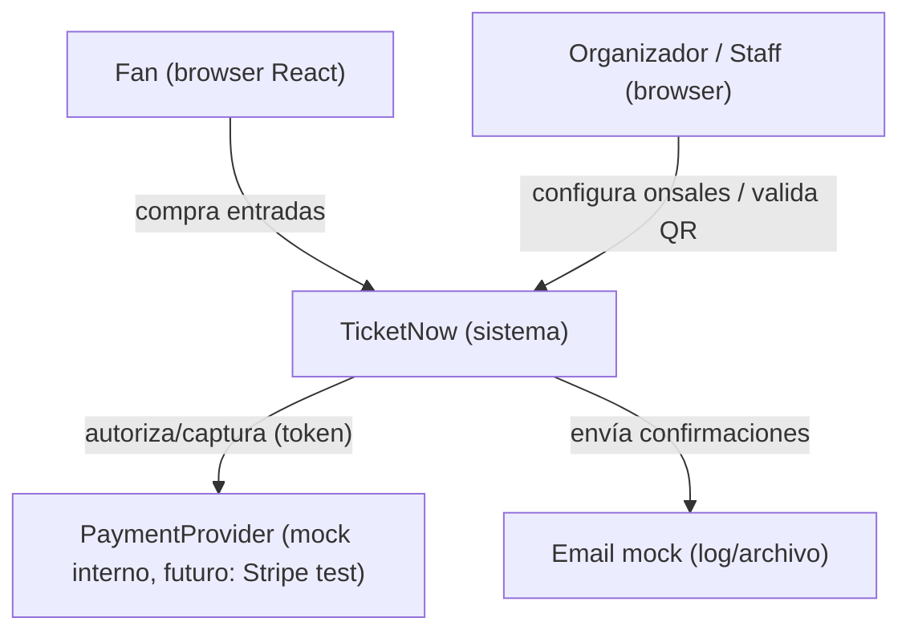
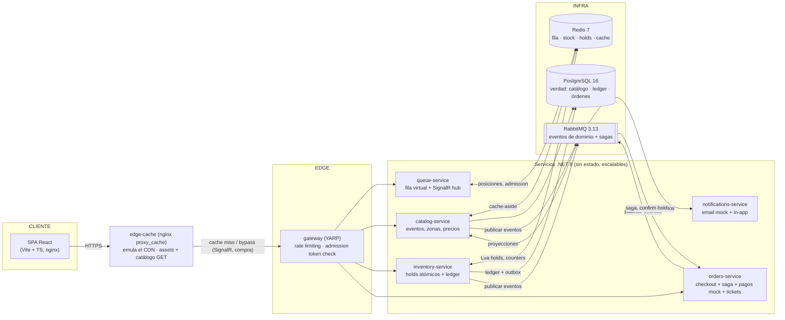
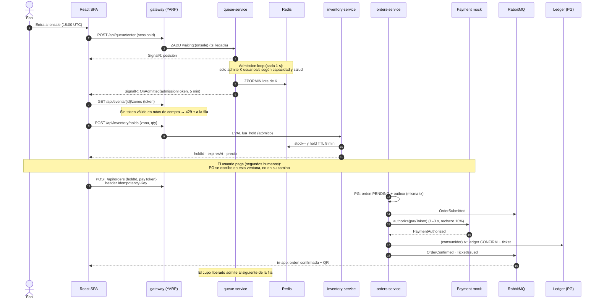

# 02 · Arquitectura

TicketNow · SDD · v1.0

---

## 1. Principios de diseño

| # | Principio | Traducción práctica |
|---|---|---|
| P1 | **El control de admisión vence al sobreaprovisionamiento** | La fila virtual decide cuánto trabajo entra; el sistema nunca recibe más carga de la que puede atender |
| P2 | **Hot path corto: máx. 1 hop síncrono + 1 op Redis** | El camino del usuario es SPA → gateway → servicio → Redis. Nada más síncrono |
| P3 | **Lo que no es sensible a latencia, es asíncrono** | Confirmaciones, tickets, notificaciones, proyecciones: eventos por RabbitMQ |
| P4 | **La verdad del dinero es ACID (PostgreSQL); la velocidad es memoria (Redis)** | PG se escribe fuera del camino crítico, vía outbox/saga |
| P5 | **Todo es idempotente o es un bug** | Idempotency-Key en mutaciones; consumidores con dedupe (inbox) |
| P6 | **Aislar el radio de explosión** | Si catálogo muere, la compra sigue; si notificaciones muere, nada crítico pasa |
| P7 | **Si no está medido, no existe** | Ninguna optimización sin métrica antes/después (RED + traces) |

## 2. Contexto (C4 nivel 1)

## 3. Contenedores (C4 nivel 2)

Notas del diagrama:

- `edge-cache` emula el CDN (ADR-008): sirve assets y `GET` de catálogo con TTL cortos; SignalR y rutas de compra lo atraviesan sin caché.
- Las flechas hacia RabbitMQ son **publicaciones**; el consumo es por suscripción. Ningún servicio llama síncronamente a otro servicio (P2/P3), con dos excepciones documentadas: gateway→X (que es el borde) y la petición de hold que hace el cliente directamente a inventory (una sola hop).
- SignalR usa Redis como backplane para escalar queue-service a N réplicas.
- PostgreSQL tiene **un schema por servicio** (`catalog`, `inventory`, `orders`, `queue_audit`, `notifications`). Ningún servicio lee el schema de otro.

## 4. Catálogo de servicios

| Servicio | Puerto (host) | Responsabilidad | Estado propio | Escala inicial |
|---|---|---|---|---|
| `edge-cache` (nginx `proxy_cache`) | 8090 (puerta pública) | Emulación local del CDN: assets del SPA + `GET` de catálogo; SignalR/compra sin caché (ADR-008) | — | 1 |
| `gateway` (YARP) | interno (tras edge-cache) | Routing, rate limit por IP/cuenta, validación de admission token en rutas de compra | — (sin estado) | 1 |
| `queue-service` | 8081 | Fila virtual: posiciones, heartbeat, tasa de admisión adaptativa, SignalR hub | Redis | 2 |
| `catalog-service` | 8082 | Eventos/venues/zonas; proyección de disponibilidad; countdown | PG `catalog` + Redis (cache) | 2 |
| `inventory-service` | 8083 | Stock por zona, holds atómicos (Lua), sweeper de expiración, ledger, reconciliador | PG `inventory` + Redis | 2 (la estrella del onsale) |
| `orders-service` | 8084 | Checkout, saga MassTransit, provider de pagos mock, emisión de QR | PG `orders` | 2 |
| `notifications-service` | 8085 | Consumidor de eventos: email mock, in-app, outbox de notificaciones | PG `notifications` | 1 |
| `spa` | interno (tras edge-cache); dev `npm run dev` :5173 | SPA React (origen de estáticos; el edge cachea assets inmutables) | — | 1 |

Infraestructura compartida: `postgres` (5432), `redis` (6379), `rabbitmq` (5672 / management 15672), `prometheus` (9090), `grafana` (3000), `jaeger` (16686). Puertos de servicios internos **no publicados** al host salvo en desarrollo (profile `debug`).

## 5. El flujo crítico: una compra durante el onsale

Qué pasa cuando las cosas fallan (resumen; detalle en [03-patrones](03-patrones.md)):

| Falla | Reacción | Patrón |
|---|---|---|
| Pago rechazado | Saga compensa: release hold + stock vuelve + usuario notificado | Saga |
| Hold expira (TTL) | Sweeper libera stock, orden PENDING cancelada, fila admite otro | Sweeper + eventos |
| Réplicas de inventory caen | Otras réplicas siguen; holds viven en Redis compartido; ledger reconcilia | Estado externo + reconciliador |
| RabbitMQ cae | Outbox retiene eventos en PG; se publica al recuperar | Outbox |
| Saturación (p95 alto) | Admission rate baja automáticamente | Backpressure |

## 6. Topología de mensajería (RabbitMQ)

Contratos compartidos en proyecto `TicketNow.Contracts` (sin dependencias). Exchange tipo `topic` por servicio publicador: `catalog.events`, `inventory.events`, `orders.events`. Colas por consumidor con DLQ (`*.dlq`) y retry diferido (MassTransit: 5 retries exponenciales → DLQ).

| Evento | Publica | Consumen | Efecto |
|---|---|---|---|
| `OnsaleOpened(eventId, zonas, stock)` | catalog | inventory, queue, notifications | inventory siembra contadores Redis; queue habilita la fila |
| `HoldGranted(holdId, zona, qty)` | inventory | orders (saga), catalog | Proyección de disponibilidad--; métricas |
| `HoldDenied(reason)` | inventory | orders (saga), queue | Métricas de demanda insatisfecha |
| `HoldExpired(holdId)` / `HoldReleased(holdId)` | inventory | orders (saga), catalog, queue | Disponibilidad++; cancelar orden PENDING; admitir siguiente |
| `OrderSubmitted(orderId, holdId)` | orders | inventory | Validación hold↔orden |
| `PaymentAuthorized(orderId)` / `PaymentDeclined(orderId)` | orders (interno) | orders (saga) | Avanza o compensa |
| `OrderConfirmed(orderId, items)` | orders | inventory, notifications, catalog | Ledger CONFIRM + ZREM hold; email + QR |
| `TicketIssued(ticketId, orderId, qr)` | orders | notifications | Entrega de entrada |
| `OrderRejected(orderId, reason)` | orders | notifications, queue | Aviso; re-admisión con gracia |

## 7. Decisiones de arquitectura (ADRs)

### ADR-001: Microservicios vs monolito modular

- **Estado:** Aceptada · **Contexto:** Pregunta legítima del stakeholder: *"¿microservicios no agrega latencia justo cuando explota la web?"*
- **Análisis:** Lo que tumba un onsale no es el hop de red interna (0.1–1 ms) sino: (a) sobrecarga sin control de admisión, (b) contención de locks sobre el stock, (c) reintentos en cascada. Un monolito sufre igual esos tres problemas y además comparte proceso: el catálogo pesado tumba el checkout.
- **Decisión:** Microservicios **con hot path corto por diseño** (P2): el camino del usuario es gateway → 1 servicio → Redis. Pagos y confirmaciones son asíncronos durante la ventana humana del checkout (segundos). La latencia síncrona agregada por la arquitectura es despreciable frente al pago (300 ms–3 s).
- **Consecuencias:** (+) Escala fila/inventario sin escalar catálogo; blast radius aislado; valor didáctico máximo. (−) Más piezas operativas (mitigado con Docker Compose y observabilidad desde Fase 0); contratos versionados requeridos.
- **Alternativas:** Monolito modular (viable; documentado como plan B si la curva didáctica aprieta — los patrones no cambian, solo el transporte de eventos pasa a in-proc).

### ADR-002: PostgreSQL + Redis (roles), y no "solo NoSQL"

- **Estado:** Aceptada · **Contexto:** *"¿No conviene que cada comprador escriba directo a una NoSQL para ir más rápido?"*
- **Análisis:** La intuición apunta al problema correcto con la solución incompleta. El cuello de botella del ticketing no es la velocidad de escritura de un RDBMS (~ms), es la **contención sobre un contador compartido** — eso lo resuelve el patrón (decremento atómico en memoria), no el motor de persistencia. Y el dinero exige ACID + auditoría: "ticket sin pago" o "entrada vendida dos veces" son bugs de consistencia que un KV eventual no previene.
- **Decisión:** Polyglot persistence con roles: **Redis** para el hot path (posiciones, contadores, holds — ~0.2 ms) y **PostgreSQL** como única verdad de dinero (ledger, órdenes, pagos, tickets), escrito **fuera del camino crítico** vía outbox/saga mientras el usuario paga.
- **Consecuencias:** (+) Zero-oversell auditable (INV-1/2/3); velocidad donde importa. (−) Dos stores que pueden divergír → se agrega un **reconciliador** continuo (ver [03-patrones §11](03-patrones.md)).
- **Alternativas:** Mongo/Cassandra como store principal (descartado: sin joins/transacciones fuertes para el dominio de dinero); SQL Server (válida, se descartó por peso del contenedor en un entorno didáctico).

### ADR-003: RabbitMQ + MassTransit como broker

- **Estado:** Aceptada · **Contexto:** Necesitamos eventos de dominio, saga state machine y outbox transaccional.
- **Decisión:** RabbitMQ 3.13 + MassTransit **v8 (OSS)**: saga state machine persistida en PostgreSQL, outbox/inbox transaccional integrados, retry + DLQ declarativos, propagación de tracing.
- **Consecuencias:** (+) Todo el middleware de resiliencia sin código propio; UI de management ideal para ver colas en vivo en clase. (−) v9 es comercial → se fija v8.x y los contratos viven en paquete propio desacoplado.
- **Alternativas:** Kafka (throughput/replay superiores, sobra complejidad operativa aquí), Redis Streams (menos fidelidad productiva, sin sagas).

### ADR-004: YARP como gateway

- **Estado:** Aceptada · **Decisión:** YARP (reverse proxy de .NET) en el borde: routing por ruta, rate limiting por IP y por cuenta (`System.Threading.RateLimiting`), y middleware de **admission token** que protege las rutas de compra (`/api/inventory/*`, `/api/orders/*`): sin token válido → 429 + redirect a fila.
- **Consecuencias:** (+) La protección vive en el borde: los servicios internos ni se enteran de la tormenta; todo en .NET (un solo stack). (−) El gateway no debe convertirse en punto único de fallo → sin estado + health checks + escalar si hace falta.

### ADR-005: Fila virtual propietaria vs servicio externo

- **Estado:** Aceptada · **Contexto:** Cloudflare Waiting Room o similar resuelve esto sin código… pero el objetivo del proyecto es didáctico.
- **Decisión:** Implementar la fila sobre Redis (ZSET por onsale + token bucket de admisión + SignalR para push de posición), con tasa de admisión **adaptativa** según métricas (backpressure).
- **Consecuencias:** (+) Control total del UX y del algoritmo (material de aprendizaje). (−) Es infraestructura crítica propia → pruebas de caos específicas (INV-4).

### ADR-006: Ledger append-only de inventario

- **Estado:** Aceptada · **Decisión:** Toda mutación de stock es un **INSERT** en `inventory.ledger` (tipo HOLD/CONFIRM/RELEASE/EXPIRE, delta, actor, holdId, created_at). Nunca UPDATE ni DELETE. El stock vigente es una derivada (suma). Redis mantiene la versión caliente.
- **Consecuencias:** (+) Auditoría total (¿quién liberó esta entrada y cuándo?); reproducible; base del reconciliador. (−) Volumen creciente → partición por mes y retención documentada.

### ADR-007: Outbox transaccional

- **Estado:** Aceptada · **Decisión:** Toda escritura de estado que deba notificar al mundo se hace en una única transacción PG: (cambio de estado) + (registro en `*_outbox`). Un dispatcher lo publica a RabbitMQ con dedupe (inbox del lado consumidor).
- **Consecuencias:** (+) Ni mensajes fantasma (evento sin estado) ni estados huérfanos (estado sin evento); garantiza INV-3. (−) Latencia extra de publicación (~centenas de ms, irrelevante: todo es asíncrono).

### ADR-008: CDN en el borde (y su emulación local)

- **Estado:** Aceptada · **Contexto:** ~95% del tráfico de un onsale es lectura (catálogo, imágenes, assets) y el escenario E2 (F5 frenético en el countdown) no debería llegar jamás al origen. En producción, un CDN además absorbe picos y DDoS L7 antes del gateway.
- **Decisión:**
  - **Qué se cachea en el borde:** (1) assets del SPA con nombres hasheados → `Cache-Control: public, max-age=31536000, immutable`; (2) imágenes de eventos; (3) `GET /api/events` y detalle → `s-maxage=30, stale-while-revalidate=60`; (4) página de countdown = HTML estático + hora obtenida por JS.
  - **Qué nunca se cachea (bypass):** `/api/inventory/*`, `/api/orders/*`, `/api/payments/*`, `/api/queue/*` y `/hubs/*` (`Cache-Control: no-store`).
  - **Invalidación:** por TTL corto (30–60 s); no se necesita purge activo — los cambios de estado relevantes viajan por eventos, no por re-lectura del catálogo.
  - **Emulación local (didáctica):** contenedor `edge-cache` (nginx `proxy_cache`) delante del gateway con exactamente estas reglas y los mismos headers que producción; test en CI que valida el header de cada endpoint. Fase 1.
- **Consecuencias:** (+) El origen solo ve tráfico de compra real (ya acotado por la fila); E2 se absorbe entero en el borde; catálogo ~0 ms en el pico. (−) Una pieza más y disciplina de `Cache-Control` desde el día 1.
- **Alternativas:** sin CDN (el origen come todo E2 — justo lo que hay que evitar); SSR con caché en CDN (innecesario para esta SPA).

### ADR-009: Checkout asíncrono con comando SubmitOrder + validación en dos tiempos

- **Estado:** Aceptada · **Contexto:** El checkout necesita atomicidad total (orden + evento) sin acoplar la API a la DB por el camino feliz, y fallar veloz ante holds inválidos.
- **Decisión:**
  - La API valida el hold por request/response (~ms) y luego ENVÍA `SubmitOrder`: la orden nace DENTRO del consumer (con outbox: orden + `OrderSubmitted` atómicos). El cliente recibe 202 y hace polling.
  - La saga re-valida autoritativamente antes de cobrar (cubre la ventana entre chequeo y pago).
  - Idempotencia en 3 capas: `Idempotency-Key` obligatorio + lock Redis + registro de recientes (UX determinista: mismo orderId) + UNIQUE en DB + consumer idempotente (backstop).
- **Consecuencias:** (+) Sin race posible hacia órdenes duplicadas; API fina y rápida. (−) El cliente debe pollear; eventualidad visible (documentada en el SPA con estados).
- **Alternativas:** crear la orden en la API y publicar después (ventana huérfana orden-sin-evento ante crash); request/response para todo el flujo (acopla latencias y pierde tolerancia a fallas).

### ADR-010: Fila virtual con free-pass configurable por onsale

- **Estado:** Aceptada · **Contexto:** El escenario E3 (onsale storm) exige un control de admisión que proteja inventario/órdenes del pico, pero no todo evento vende bajo tormenta: forzar fila en un evento chico degrada la UX sin beneficio.
- **Decisión:**
  - El estado de la fila vive en Redis (ZSETs `waiting`/`seen`/`admitted` + hashes de sesión): O(log n) en pops y posiciones, sin tocar PG.
  - Un loop de admisión (1 s) calcula la tasa K con histéresis: salud del inventario degradada → K/2 (hasta el mínimo); salud OK → +10% por ciclo (hasta el máximo). Backpressure real: la puerta de entrada cede antes que el interior.
  - Sesión admitida = **lease de 60 s + token JWT (HS256, 5 min)** con claims (sessionId, onsaleId). El gateway exige el token (`X-Admission-Token`) en `/api/inventory/*`, `/api/orders/*`, `/api/payments/*`, `/api/tickets/*` y responde **429 `admission_required`** — la decisión de admisión se toma UNA vez, en el borde.
  - **Free-pass:** si el onsale tiene `requiresQueue=false` (config del catálogo u override admin), `/api/queue/enter` admite en el acto y devuelve el token. Misma interfaz y mismas garantías del gateway: el modo se elige por venta, no por código.
  - Configuración con precedencia: override admin (incidentes) > catálogo (`GET /api/events/{id}/onsale-config`, caché 30 s, fail-open si el catálogo cae).
  - Push de posición/admisión por SignalR (`/hubs/queue`, backplane Redis) con fallback REST (`GET /api/queue/me`, que re-emite el token si la sesión ya está admitida — un cliente que perdió el push lo recupera polleando).
- **Consecuencias:** (+) E3 se serializa en la puerta; el interior procesa a su ritmo (K adapta); los eventos sin tormenta no pagan fila. (−) Estado en Redis que hay que operar (reaper de abandonos cada 10 s, gracia 60 s); una clave de firma compartida gateway↔queue-service (rotación por env).
- **Alternativas:** rate-limit por IP en el gateway (no garantiza fairness NI una sola compra por humano); fila en PG (cuello de botella en el pico, justo donde duele); tokens opacos en tabla (otra lectura fuerte en el borde).

### ADR-011: Identidad y límites de Fase 6 (JWT usuario + cupo por cuenta aportado por el cliente)

- **Estado:** Aceptada · **Contexto:** La compra necesita saber QUIÉN compra (cupo por cuenta, rate limit por cuenta, trazabilidad) sin acoplar los servicios a un IdP, y el límite por cuenta necesita el evento y el tope donde la orden nace (orders-service no conoce ninguno de los dos).
- **Decisión:**
  - JWT de usuario (HS256, `Auth:UserSigningKey`, solo gateway): `POST /api/auth/token` mock (email → sub estable, TTL 12 h; en producción esto es un IdP). Las rutas de compra exigen policy `purchase` = admission + user (ambas identidades, una sola respuesta de error determinista: sin turno 429 a la fila, sin identidad 401 al login).
  - El gateway propaga el `sub` como `X-User-Id` aguas abajo: los servicios no cambian de contrato.
  - Límite por cuenta: el cliente envía `eventId` + `maxPerAccount` (los ve en el catálogo de todos modos); el SERVIDOR cuenta (tickets + órdenes vivas por usuario y evento) y enforcea en dos tiempos — API 409 veloz + consumer autoritativo (cubre la carrera entre gemelos; la orden nace Rejected y polleable, no 404 eterno).
  - Rate limit por cuenta (30 req/min en compra) + por IP (600 req/min): el global corre pre-auth (cubre rutas anónimas como el enter a la fila); el de cuenta es manual post-auth (el `User` se puebla en la evaluación de la policy, no antes).
- **Consecuencias:** (+) Servicios desacoplados del IdP y del catálogo; límites reales sin joins entre BCs. (−) El valor del tope lo aporta el cliente (un cliente malicioso podría declarar un tope mayor — el conteo es server-side pero el techo es declarativo; en producción el tope debe viajar firmado o leerse del catálogo server-side). (−) Un bucket por usuario en memoria del gateway (didáctico; en producción, Redis).
- **Alternativas:** orders consulta al catálogo por HTTP en el camino feliz (acopla latencias y disponibilidad); userId solo como header sin firmar (el estado previo: spoofeable, sin límites posibles).

### ADR-012: Turno atado al evento + revocación al salir

- **Estado:** Aceptada · **Contexto:** El admission token decía PARA QUÉ evento era (claims `onsale`/`event`), pero nadie lo exigía: el gateway solo valida firma y vigencia, así que un turno del evento A compraba en el B. Y salir de la fila (`DELETE /me`) borraba la sesión pero el JWT seguía válido hasta expirar: salir no hacía perder el turno.
- **Decisión:**
  - El servicio que VENDE exige el bindeo: `POST /inventory/holds` y `POST /orders` verifican firma + vigencia, que `token.event == evento comprado` (comparación por Guid, tolera formatos `"D"`/`"N"`) y que la sesión no esté revocada (`AdmissionChecker` compartido en ServiceDefaults). Sin token: fail-open a propósito — sin credencial no hay nada que bindear; el gateway garantiza presencia en producción y directo al servicio es tests/dev.
  - `LeaveAsync` escribe `revoked-session:{session}` con TTL 5 min (= TTL máximo de un token); `EnterAsync` lo limpia (volver a entrar es turno nuevo).
  - Respuestas machine-readable: 403 `admission_for_other_event` ("ese turno es de otro evento"), 403 `admission_revoked` ("saliste: volvé a entrar"), 401 `admission_invalid`. La SPA limpia el turno stale al cambiar de evento y traduce cada código.
- **Consecuencias:** (+) El turno es intransferible entre eventos y muere al salir; las colas por evento (que ya eran claves separadas) ahora sí se comportan como separadas. (−) Un roundtrip extra a Redis por compra (GETDEL/EXISTS, ~µs; mismo Redis del hot path). (−) Ventana residual: token usado ENTRE salir y la escritura del marcador (ms, y requiere tener el token en mano tras salir a propósito).
- **Alternativas:** bindear en el gateway (no conoce el evento sin parsear bodies — no); lista de JTIs emitidos con TTL (más estado para el mismo efecto; la revocación por sesión cubre todos los tokens re-emitidos de una vez).

## 8. Deuda técnica consciente (didáctica)

| Deuda | Por qué se acepta | Camino de producción |
|---|---|---|
| Un solo PostgreSQL (schemas separados) | Menos contenedores para desarrollo | DB por servicio + réplicas de lectura |
| Redis single node con AOF | Simplicidad; el reconciliador cubre divergencia | Réplica + Sentinel/Cluster |
| Pago mock interno | Sin PCI real | Stripe/PSP externo con tokenización |
| Docker Compose (sin k8s) | El foco son los patrones, no la orquestación | Helm/K8s con HPA; el diseño ya es stateless |
| Sin mapa de asientos individual | Simplifica el dominio | Extendible: el hold pasa de (zona, qty) a (asientos[]) |
