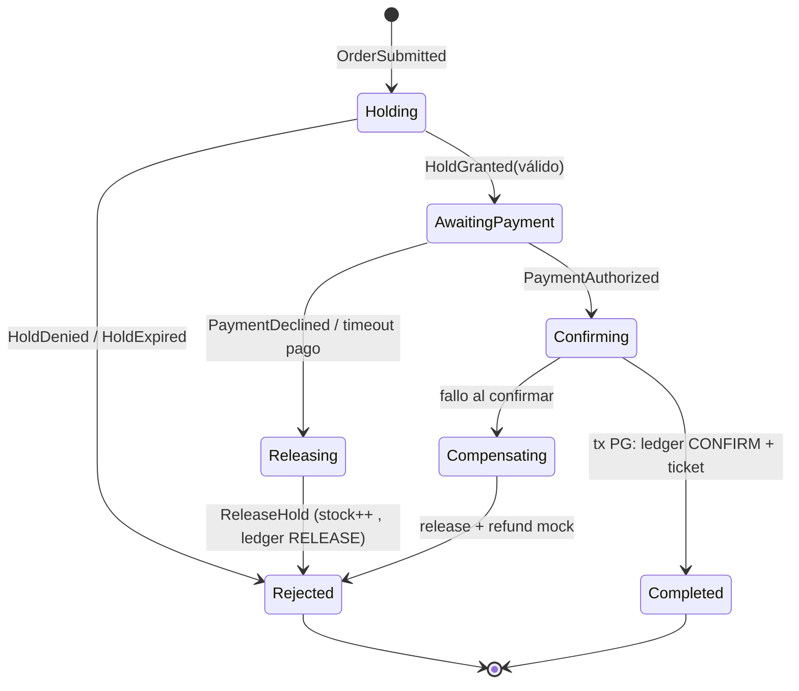

# 03 · Patrones aplicados

TicketNow · SDD · v1.0 — El corazón didáctico del proyecto.

> Formato de cada patrón: **Problema** → **Modo de falla si no está** (así se ve por qué existe) → **Cómo lo aplicamos** (con snippet o diagrama) → **Parámetros operativos** → **Dónde vive**.

---

## 1. Virtual Waiting Room (fila virtual) + control de admisión

**Problema.** En el segundo cero del onsale llegan ~5.000 usuarios para un sistema que atiende ~2.000 concurrentes. Por mucho que escales, la demanda puede superar la capacidad: hay que decidir **quién entra y cuándo**, y comunicarlo con justicia.

**Modo de falla sin esto.** Todos entran → las colas de requests se saturan → timeouts → el frontend reintenta → la tormenta se multiplica → DB y APIs mueren → 500 para todos (el clásico "Ticketmaster colapsó").

**Solución aplicada** (queue-service sobre Redis + SignalR):

1. `POST /api/queue/enter` → `ZADD waiting:{onsaleId} score=tsDeLlegada member=sessionId` (posición = rank en el ZSET).
2. **Admission loop** (background, 1 s): calcula `K` efectivo y hace `ZPOPMIN waiting:{onsaleId} K` → a cada admitido se le emite un **admission token** (JWT, 5 min, renovable con actividad) y se le notifica por SignalR (`OnAdmitted`).
3. El **gateway** rechaza con 429 toda llamada a rutas de compra sin token válido → la tormenta nunca toca los servicios internos.
4. **Heartbeat:** el cliente pingea cada 30 s por SignalR; sin señal por 60 s (gracia), se lo saca de la fila (justicia con reconexión breve).
5. **Justicia FIFO (INV-4):** el score es `(tsLlegada, nonce)` y solo el propio servicio reordena.

```text
K efectivo = min(
  tasaConfigurada,                       -- ej. 50/s (organizador)
  cupoDisponible,                        -- maxConcurrentes - activos - reservado
  ajusteBackpressure                     -- <1 si p95/error rate altos (ver §9)
)
```

**Parámetros.** Gracia de reconexión 60 s · admission token TTL 5 min (renueva con actividad) · capacidad dentro: 2.000 · tasa inicial 50/s.

**Detalles de implementación (Fase 4):**

- Estado 100% en Redis: ZSETs `waiting`/`seen` (dedupe de reingresos, conserva el lugar) /`admitted` (con score = expiración del lease) + hash de sesión (usuario, último heartbeat). Sin PG en el camino caliente del pico.
- Sesión admitida = **lease de 60 s** (renovado por heartbeat): si no hay señal, el reaper (ciclo 10 s) la devuelve a la fila **conservando su posición original** (score del ZSET seen) y reconcilia los contadores de	stats.
- Tasa adaptativa con histéresis (§9): salud degradada → K/2 (piso = minRate); salud OK → +10% por ciclo (techo = maxRate). Nunca salta: la tasa baja rápido y sube lento.
- **Free-pass (ADR-010):** onsale con `requiresQueue=false` → `enter` admite en el acto y devuelve el token. El gateway igual exige el token: la política vive en el borde, no en cada servicio.
- Config: override admin > catálogo (`onsale-config`, caché 30 s). Catálogo caído → fail-open con lo último sabido (o override).
- Fallback REST: `GET /api/queue/me` re-emite el admission token si la sesión ya está admitida (un cliente que perdió el push de SignalR lo recupera polleando).

**Detalles de implementación (bindeo + revocación, ADR-012):**

- El turno es POR EVENTO aunque las colas ya eran claves separadas: `POST /holds` y `POST /orders` exigen `token.event == evento comprado` (403 `admission_for_other_event`). El gateway no puede hacerlo (no conoce el evento sin parsear bodies): lo hace el que vende.
- Salir = perder el turno: `LeaveAsync` escribe `revoked-session:{session}` (TTL 5 min); `EnterAsync` lo limpia (volver es turno nuevo). Sin token en el request: fail-open documentado (el gateway garantiza presencia en prod).
- Efecto UX que parecía "cola compartida": entrar a un evento vacío admite al instante (correcto: sin fila no hay espera) y el token stale del evento anterior viajaba en el header — ahora el servidor lo rechaza y la SPA lo descarta al cambiar de evento.

**Dónde vive.** queue-service + gateway (exigencia del token). Referencias: AWS Virtual Waiting Room reference architecture; Cloudflare Waiting Room.

---

## 2. Reservation Pattern con decremento atómico (holds)

**Problema.** Entre "el usuario elige" y "el usuario paga" pasan minutos. Sin reservar, dos personas "ven" la misma disponibilidad y el último en pagar pierde (o peor: ganan dos). El stock además es un contador único: 500 hilos haciendo `UPDATE stock = stock - 2` generan contención brutal.

**Modo de falla sin esto.** (a) Oversell con check-then-act en dos pasos (`SELECT` y luego `UPDATE`): la clásica race condition; (b) o locks pesimistas en PG: la cola de espera sobre una fila derrumba el throughput.

**Solución aplicada** (inventory-service): una única operación **atómica** en Redis vía script Lua (chequeo + decremento + registro del hold con TTL, todo o nada):

```lua
-- KEYS[1]=stock:{eventId}:{zoneId}   KEYS[2]=holds:{eventId}
-- ARGV: holdId, qty, expiraAtUnix, ttlSeg, payloadJSON
local stock = tonumber(redis.call('GET', KEYS[1]) or '-1')
local qty   = tonumber(ARGV[2])
if stock < qty then return 0 end                 -- no hay: fallo limpio
redis.call('DECRBY', KEYS[1], qty)               -- no hay ventana de race
redis.call('ZADD',  KEYS[2], ARGV[3], ARGV[1])   -- hold visible para el sweeper
redis.call('SET', 'hold:'..ARGV[1], ARGV[5], 'EX', ARGV[4])
return 1
```

Confirmar (`CONFIRM`) y liberar (`RELEASE`/`EXPIRE`) también son scripts que: restauran o cementan el stock, remueven el ZSET y dejan constancia en el ledger (§3). Todo consumidor es idempotente por `holdId` (§7).

**Parámetros.** TTL hold 8 min · qty máx 4 por hold · límite por cuenta: 4 por evento (configurable).

**Dónde vive.** inventory-service. Referencias: patrón "Reservation" en sistemas de ticketing/aerolíneas; scripting/atomicity docs de Redis.

### 2.1 Estrategia de locks y aislamiento en PostgreSQL (explícita)

Respuesta directa a "¿qué tipo de lock usamos en la base?": **en el hot path, ninguno**; fuera del hot path, locks de fila cortos + constraints. Detalle por operación:

| Operación | Lock en PG | Aislamiento | Por qué |
|---|---|---|---|
| Hold / Release / Expiry (hot path) | **Ninguno — no toca PG** | — | La atomicidad vive en el Lua de Redis (§2); PG jamás hace check-then-act de stock, así que no hay ventana de race que bloquear |
| Ledger INSERT (asíncrono, off-path) | Ninguno (append) | READ COMMITTED | Insertar filas nuevas no contiende; segunda barrera de INV-1: partial unique index `UNIQUE (hold_id) WHERE entry_type = 'CONFIRM'` |
| CONFIRM (tx: order + ledger CONFIRM + ticket) | **Row-level**: `SELECT … FOR UPDATE` sobre la fila de la orden; transacción < 50 ms | READ COMMITTED | Solo un consumidor cementa esa orden; lock corto sobre una fila propia del flujo |
| Estado de saga | **Optimista** (rowversion que usa la persistencia EF de MassTransit) | — | Dos consumidores no pueden avanzar la misma instancia; conflicto → retry del mensaje |
| Reparación del reconciliador | **Advisory**: `pg_advisory_xact_lock(hashtext(zone_id))` | — | Dos corridas/instancias no reparan la misma zona a la vez |
| Siembra de stock (`OnsaleOpened` → Redis) | Ninguno; `SET NX` | — | Replay del evento no reinicializa los contadores |

Lo que deliberadamente **no** usamos, y por qué:

- `SERIALIZABLE`: no hay check-then-act en PG (la decisión atómica está en Redis); solo agregaría aborts y retries.
- Locks pesimistas de página/rango sobre el stock: es exactamente el anti-patrón que derrumba los ticketing (toda la fila de compradores encolada sobre un registro).
- Redlock / locks distribuidos Redis↔PG para dinero: la ventana de falla la cierran TTL + ledger + reconciliador (§11), con menos modos de falla que un lock distribuido.

---

## 3. Ledger append-only (inventario auditable)

**Problema.** ¿Confiamos el dinero a un contador mutable en memoria? ¿Cómo respondemos "¿por qué esta entrada está libre otra vez?" o "¿quién compró la entrada 1337?".

**Modo de falla sin esto.** Un contador (`stock = 57`) no cuenta historia: cualquier bug lo corrompe silenciosamente y es irrecuperable.

**Solución aplicada** (ADR-006): cada movimiento es un INSERT en `inventory.ledger`:

```sql
INSERT INTO inventory.ledger
  (entry_id, event_id, zone_id, entry_type, qty, hold_id, order_id, actor, created_at)
VALUES
  (gen_random_uuid(), $1, $2, 'HOLD',  -2, $3, NULL,   'inventory', now());  -- o CONFIRM/RELEASE/EXPIRE
```

El stock real de una zona = `capacity + SUM(delta)`. Redis mantiene la versión caliente; el **reconciliador** (§11) compara ambas verdes y repara divergencias. El ledger es la base para reproducir el estado ante desastres.

**Dónde vive.** inventory-service (schema `inventory`).

---

## 4. Saga orquestada (MassTransit state machine)

**Problema.** La compra atraviesa 3 servicios (inventario, pagos, órdenes) y no existe una transacción ACID distribuida práctica. Cada paso puede fallar después de que otro ya comprometió algo.

**Modo de falla sin esto.** Se cobra y se pierde el ticket; o se libera el stock de una entrada ya vendida (¡oversell!).

**Solución aplicada** (orders-service): saga `OrderStateMachine` persistida en PG:



Boceto del state machine:

```csharp
public class OrderStateMachine : MassTransitStateMachine<OrderState>
{
    public State Holding, AwaitingPayment, Confirming, Releasing, Completed, Rejected;

    public OrderStateMachine()
    {
        InstanceState(x => x.CurrentState);

        Initially(
            When(OrderSubmitted)
                .Then(ctx => ctx.Saga.HoldId = ctx.Message.HoldId)
                .Send(new Uri("queue:inventory.hold-validate"), ctx => new ValidateHold(ctx.Saga.CorrelationId))
                .TransitionTo(Holding));

        During(Holding,
            When(HoldGranted).TransitionTo(AwaitingPayment)
                .Publish(ctx => new RequestPayment(ctx.Saga.CorrelationId)),
            When(HoldExpired).TransitionTo(Rejected)
                .Publish(ctx => new NotifyExpired(ctx.Saga.CorrelationId)));

        During(AwaitingPayment,
            When(PaymentAuthorized).TransitionTo(Confirming)
                .Publish(ctx => new ConfirmOrder(ctx.Saga.CorrelationId)),
            When(PaymentDeclined).TransitionTo(Releasing)
                .Publish(ctx => new ReleaseHold(ctx.Saga.HoldId))); // compensación

        During(Confirming,
            When(OrderConfirmed).TransitionTo(Completed)
                .Publish(ctx => new IssueTicket(ctx.Saga.CorrelationId)),
            When(ConfirmFailed).TransitionTo(Releasing));
        // ... timeouts por estado (ej. pago > 3 min → Releasing)
    }
}
```

**Reglas de oro.** Cada compensación es idempotente; todo timeout de estado está definido; la expiración autoritativa del hold es el sweeper (§5), no el TTL de Redis.

**Dónde vive.** orders-service (persistencia `orders.saga_instances`). Referencias: MassTransit sagas; "Saga" en *Enterprise Integration Patterns* (Hohpe).

---

## 5. Sweeper de expiración (+ TTL como red de seguridad)

**Problema.** Los holds deben liberarse solos si el usuario abandona. Confiar solo en el TTL de Redis deja la orden PENDING colgada y nadie avisa a la saga/fila.

**Solución aplicada** (inventory-service): background job cada 5 s: `ZRANGEBYSCORE holds:{eventId} -inf now` → para cada hold vencido: script `EXPIRE` (stock++, ledger EXPIRE, ZREM) → publica `HoldExpired` → saga cancela, catálogo actualiza disponibilidad, fila admite otro. El TTL de Redis es **red de seguridad**, no mecanismo primario.

---

## 6. Outbox transaccional (+ inbox en consumidores)

**Problema.** Escribir en PG y publicar a RabbitMQ son dos operaciones: si falla la segunda, el estado existe pero nadie se entera (huérfano); si se publica antes de commitear, puede existir el evento sin estado (fantasma).

**Solución aplicada** (ADR-007):

```csharp
await using var tx = await db.Database.BeginTransactionAsync();
db.Orders.Add(order);                       // 1) estado
db.Outbox.Add(OutboxMessage.From(new OrderSubmitted(order.Id)));  // 2) evento pendiente
await db.SaveChangesAsync();
await tx.CommitAsync();
// dispatcher de MassTransit (EF Core outbox) lo publica con reintentos + dedupe
```

Los consumidores usan **inbox** (tabla de mensajes procesados) → reintentos y duplicados de red no causan doble efecto (necesario para INV-1 en `CONFIRM`).

---

## 7. Idempotencia de extremo a extremo

**Problema.** El usuario hace click en "Pagar", la red se corta, el frontend reintenta. Dos órdenes = dos cobros = dos tickets para el mismo hold.

**Solución aplicada:**

- **API:** header `Idempotency-Key` (GUID por intento lógico) en `POST /orders` y `POST /payments/*`; middleware guarda hash+respuesta en Redis 24 h → replay devuelve la misma respuesta.
- **Consumidores:** dedupe por (`MessageId`, `CorrelationId`) vía inbox de MassTransit.
- **Dominio:** únicos parciales (`orders(order_id)`, `ledger(hold_id, entry_type)` donde aplique) como última barrera.

---

## 8. CQRS-lite con proyecciones y cache-aside

**Problema.** El catálogo recibe 95% del tráfico de lectura; no puede golpear PG ni calcular stock real en cada request. A la inversa, el stock exacto no debe calcularse en el hot path de compra.

**Solución aplicada:**

- **Cache-aside** (catalog-service): `GET /events` y detalle desde Redis (`catalog:*`), TTL 60 s + invalidación por evento `EventChanged`. Protección anti-stampede: single-flight (una sola reconstrucción de cache; el resto espera).
- **Disponibilidad aproximada:** proyección actualizada por eventos de inventory (`HoldGranted`/`Released`/`Expired`/`Confirmed`) → "Disponible: alta/media/agotado". **Eventual by design** (~1 s): el número exacto solo se conoce al pedir el hold — esa es la única verdad, y está en Redis.
- Didáctico: este es el punto donde se *ve* la consistencia eventual trabajando a favor.

**Dónde vive.** catalog-service (lector de eventos) + Redis.

---

## 9. Backpressure con admisión adaptativa

**Problema.** Ni la mejor capacidad es fija: GC pauses, un pago lento, una réplica menos. Si la fila admite a tasa fija, el sistema puede ahogarse por dentro.

**Solución aplicada** (queue-service): el admission loop ajusta `K` con realimentación simple con histéresis:

```text
cada 5 s:
  si p95(hold) > 40 ms  o error rate > 2%  o rabbit backlog > umbral:
      K = max(K * 0.5, Kmin)          -- cierra la canilla
  si no, y métricas cómodas por 3 ciclos:
      K = min(K * 1.1, Kmax)          -- abre gradual
```

Métricas vía Prometheus (histograms propios + métricas de RabbitMQ). El dashboard del organizador muestra `K` en vivo: **es literalmente ver el backpressure funcionando**.

---

## 10. Rate limiting + circuit breaker + timeouts

**Solución aplicada:**

- **Gateway:** token bucket por IP (100 req/min) y por cuenta (300/min); límites agresivos en rutas de compra; respuesta 429 + `Retry-After`.
- **Servicios:** `System.Threading.RateLimiting` interno como segunda capa (defense in depth).
- **Http salientes** (payment mock, etc.): `Microsoft.Extensions.Http.Resilience` — timeout total 5 s, 3 retries con jitter, circuit breaker (50% errores / 30 s). **Nunca** retry en mutaciones no idempotentes sin idempotency key.
- **Cascada evitada:** fail fast y colas acotadas; nada de threads bloqueados esperando (los `await` y la asincronía end-to-end son política de código).

---

## 11. Reconciliador continuo (watchdog de invariantes)

**Problema.** Dos stores (Redis rápido, PG verdadero) pueden divergír por cualquier bug o caída sucia. INV-1 no puede depender de la esperanza.

**Solución aplicada** (inventory-service, cada 30 s): por zona: `capacity + SUM(ledger.delta de CONFIRM/HOLD activos)` vs contador Redis → si difieren: repara desde el ledger (el ledger manda), alerta a Prometheus/Grafana y enmarca el incidente. Expone métrica `inventory_divergence_total` — **el canario anti-oversell**. También valida INV-2 (holds en ZSET sin TTL y viceversa) e INV-3 (tickets sin pago autorizado). La reparación toma un advisory lock por zona (§2.1) para que dos instancias no reparen lo mismo a la vez.

---

## 12. Anti-bot didáctico y límites de negocio

**Solución aplicada** (capas, sin ilusiones de perfección — Fase 6 implementa 1–4; 5 queda documentada):

1. Fila con sesión anónima + **1 posición por (cuenta, dispositivo-hash)**. ✅ (Fase 4)
2. Proof-of-work opcional (hashcash ~20 bits) para entrar a la fila en onsales "bandera". ✅ (Fase 6: `PowDifficulty` por onsale, challenge de un solo uso en Redis con TTL 2 min, 428 + reintento; 0 = desactivado)
3. Límite por cuenta: 4 entradas/evento; límite por tarjeta-token (hash): 8. ✅ parcial (Fase 6: cupo por cuenta+evento enforceado en API y saga, [ADR-011](02-arquitectura.md#adr-011-identidad-y-límites-de-fase-6-jwt-usuario--cupo-por-cuenta-aportado-por-el-cliente); el límite por tarjeta queda pendiente)
4. Captcha mock antes de pagar (stretcha: hCaptcha test). ✅ (Fase 6: aritmética de un solo uso con TTL 5 min, obligatoria para tokenizar; placeholder honesto)
5. Detección simple: mismo hash de dispositivo en N cuentas → flag y sombreado (no bloqueo) para el organizador. ⏳ pendiente (requiere fingerprinting real en el cliente)

---

## 14. Apertura de onsales por evento (OnsaleOpened)

**Problema.** El estado "onsale" se computa en lectura (reloj + config), pero la siembra de stock y la habilitación de la fila son EFECTOS que deben ocurrir exactamente una vez, justo cuando llega la hora — sin intervención manual ni polling entre servicios.

**Solución aplicada** (Fase 5, contrato `OnsaleOpened` en Contracts):

1. `catalog.Onsale.OpenedAt` (nullable) es la marca de agua: el `OnsaleOpenerWorker` (cada 5 s) toma onsales con `OpenedAt == null && OpensAt <= now`, marca la hora y publica `OnsaleOpened(eventId, opensAt, zones[id, name, capacity, price], maxPerAccount)` — publish + SaveChanges en la misma transacción (outbox, ADR-007).
2. `inventory` consume → `SeedAsync` idempotente (SETNX por zona; replays no duplican). El endpoint admin `/seed` queda para tests e incidentes.
3. `queue` consume → invalida la caché de config, resuelve la config fresca del catálogo y arranca la tasa K en el valor inicial (evita el arranque en 0 del primer tick).

Replay-safe de punta a punta: si el evento se re-publica, la siembra no duplica y la tasa se re-setea al mismo valor.

---

## 13. Mapa patrón → servicio → fase

| # | Patrón | Servicio | Fase roadmap |
|---|---|---|---|
| 1 | Virtual waiting room + admisión | queue, gateway | 4 |
| 2 | Reservation (Lua atómico) | inventory | 2 |
| 3 | Ledger append-only | inventory | 2 |
| 4 | Saga orquestada | orders | 3 |
| 5 | Sweeper de TTL | inventory | 2 |
| 6 | Outbox/inbox transaccional | todos (escritores) | 3 |
| 7 | Idempotencia | gateway, orders, inventory | 3 |
| 8 | CQRS-lite + cache-aside | catalog | 1–2 |
| 9 | Backpressure adaptativo | queue | 4–5 |
| 10 | Rate limit + circuit breaker | gateway, orders | 4–5 |
| 11 | Reconciliador | inventory | 2 |
| 12 | Anti-bot/límites | gateway, queue, orders | 6 |
| 13 | Cache de borde (CDN emulado con nginx) | edge-cache, catalog | 1 |
| 14 | Apertura por evento (marca de agua + fan-out) | catalog, inventory, queue | 5 |

## 14. Referencias de estudio

- *Release It!* (2.ª ed.) — Michael Nygard: circuit breakers, bulkheads, backpressure.
- *Designing Data-Intensive Applications* — Martin Kleppmann: consistencia, ledger, particionamiento.
- AWS Architecture Blog — "Virtual waiting room" reference architecture.
- Cloudflare — "How we built Waiting Room" (serie técnica).
- Documentación de MassTransit (sagas, outbox), de YARP, y de `System.Threading.RateLimiting`.
- Caso real motivador: US Senate report + Ticketmaster post-mortem público del Eras Tour onsale (nov. 2022).
