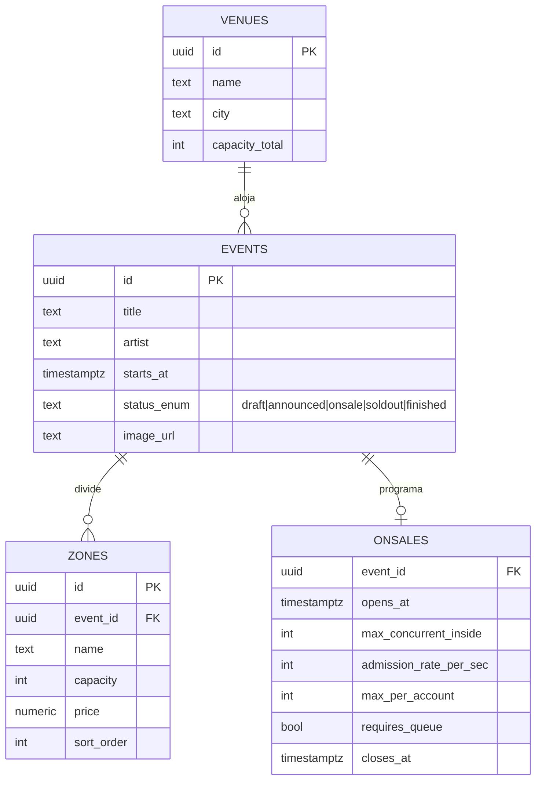
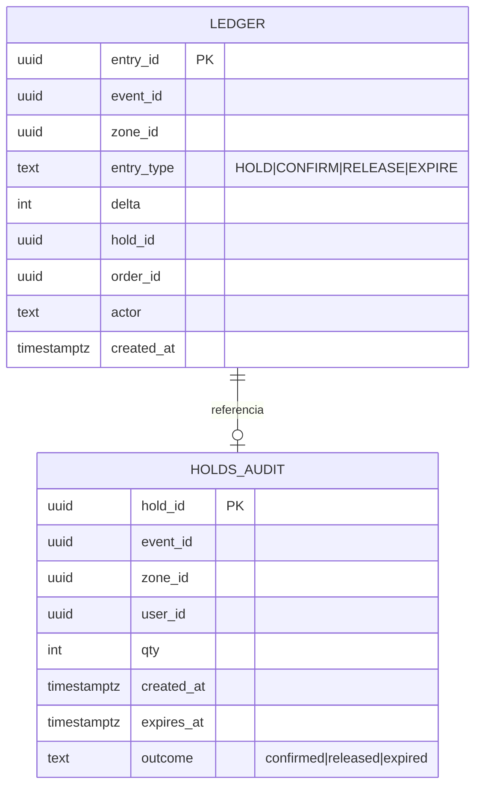
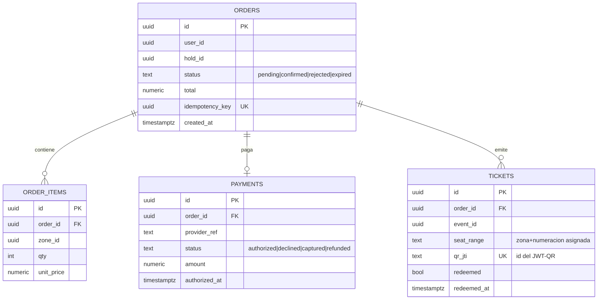

# 04 · Datos y APIs

TicketNow · SDD · v1.0

---

## 1. Ownership de datos

Regla: **cada dato tiene un único dueño**; los demás servicios solo lo conocen por eventos (eventualmente consistentes) o por APIs de solo lectura.

| Dato | Dueño (escribe) | Consumidores | Cómo lo ven |
|---|---|---|---|
| Eventos, venues, zonas, precios, config de onsale | catalog | todos | Eventos + API + cache Redis |
| Stock por zona (contador caliente) | inventory | catalog (proyección) | Eventos `Hold*` |
| Ledger de inventario | inventory | (auditoría, reconciliador) | Interno |
| Holds activos | inventory | orders, queue | Eventos + API interna |
| Órdenes, pagos, tickets, saga | orders | notifications, fan | Eventos + API |
| Posiciones de fila, admission tokens | queue | gateway | Interno Redis + claims del token |
| Notificaciones enviadas | notifications | — | Interno |

## 2. PostgreSQL — esquemas y tablas esenciales

Un solo cluster, **un schema por servicio**. DDL completo en migraciones EF Core; aquí el modelo lógico.

### `catalog`



### `inventory`



Índices: `ledger(event_id, zone_id, created_at)` y partición por mes. *No hay columna `stock`: es derivada.*

### `orders`



Más tablas de MassTransit: `orders.saga_instances`, y outbox/inbox por servicio (`{schema}.outbox_messages`, `{schema}.inbox_states`).

## 3. Redis — keyspace (hot path)

| Clave | Tipo | TTL | Escribe | Lee | Contenido |
|---|---|---|---|---|---|
| `waiting:{onsaleId}` | ZSET | mientras dure | queue | queue | member=sessionId, score=ts llegada |
| `admitted:{onsaleId}` | counter | — | queue | queue, prometheus | concurrentes dentro ahora |
| `admission:{onsaleId}:rate` | string | — | queue (backpressure) | queue | K actual |
| `session:{sessionId}` | hash | 90 s (heartbeat) | queue | queue | userId, onsale, deviceHash, lastSeen |
| `stock:{eventId}:{zoneId}` | string(int) | — | inventory (sembrado en `OnsaleOpened`) | inventory, catalog | unidades libres |
| `holds:{eventId}` | ZSET | — | inventory | inventory (sweeper) | member=holdId, score=expiraAt |
| `hold:{holdId}` | hash | 9 min (TTL red de seguridad) | inventory | inventory | qty, zoneId, userId, orderId?, exp |
| `idem:{key}` | string(JSON) | 24 h | gateway/middleware | idem | respuesta cacheada |
| `catalog:events:page:{n}:{filtros}` | string(JSON) | 60 s | catalog | catalog | listado cacheado (single-flight) |
| `catalog:availability:{eventId}` | hash | — | catalog (proyección) | catalog | zona → high/medium/low/soldout |
| `ratelimit:{ip|user}:{ventana}` | counter | ventana | gateway | — | token bucket / fixed window |

Politicas: ningún valor de negocio vive **solo** en Redis (siempre hay verdad en PG: ledger, órdenes, auditoría de holds). AOF `everysec`.

## 4. RabbitMQ — topología

- Exchanges `topic`: `catalog.events`, `inventory.events`, `orders.events`.
- Colas por consumidor (binding por routing key = nombre de evento): `inventory.catalog.onsale`, `orders.inventory.holds`, `notifications.orders.*`, `catalog.inventory.holds`, `queue.inventory.holds`…
- Cada cola: DLQ (`{cola}.dlq`), retry diferido MassTransit (5 intentos, backoff exponencial).
- Mensajes: JSON, `application/json`, con `MessageId` (dedupe) y trace context (W3C `traceparent`).

### Contratos de eventos (proyecto `TicketNow.Contracts`)

Ejemplo canónico:

```json
// routing key: "OrderConfirmed" · exchange: orders.events
{
  "messageId": "0198c7a2-... ",       // dedupe inbox
  "correlationId": "order-uuid",       // = orderId (saga)
  "occurredAt": "2026-09-18T18:03:11Z",
  "payload": {
    "orderId": "…uuid…",
    "holdId": "…uuid…",
    "items": [{ "zoneId": "…", "qty": 2, "unitPrice": 85.00 }],
    "total": 170.00,
    "userId": "…uuid…"
  }
}
```

## 5. APIs REST (por servicio; el gateway las expone bajo `/api/*`)

### queue-service

| Método | Ruta | Descripción | Auth |
|---|---|---|---|
| POST | `/api/queue/enter` | Entrar a la fila del onsale → `{queueId, position, etaSeconds}` | sesión anónima |
| GET | `/api/queue/me` | Posición actual (fallback polling) | sesión |
| POST | `/api/queue/heartbeat` | Renovar sesión (además del SignalR) | sesión |
| DELETE | `/api/queue/me` | Salir voluntariamente | sesión |

### catalog-service

| Método | Ruta | Descripción | Auth |
|---|---|---|---|
| GET | `/api/events?search&city&page` | Listado paginado (cache) | público |
| GET | `/api/events/{id}` | Detalle + countdown | público |
| GET | `/api/events/{id}/zones` | Zonas + disponibilidad aproximada | público |
| POST/PUT | `/api/admin/events`… | CRUD organizador (incl. config onsale) | rol `organizer` |

### inventory-service

| Método | Ruta | Descripción | Auth |
|---|---|---|---|
| POST | `/api/inventory/holds` | Crear hold `{eventId, zoneId, qty}` + `Idempotency-Key` → `{holdId, expiresAt, price}` **201** o **409** sin stock | admission token |
| DELETE | `/api/inventory/holds/{id}` | Liberación voluntaria | admission token + dueño |
| GET | `/api/inventory/holds/{id}` | Estado del hold (frontend: countdown) | dueño |

### orders-service

| Método | Ruta | Descripción | Auth |
|---|---|---|---|
| POST | `/api/orders` | Checkout `{holdId, paymentToken, billing}` + `Idempotency-Key` → `{orderId, status}` | admission token + user |
| GET | `/api/orders/{id}` | Estado (saga en vivo) | dueño |
| GET | `/api/orders/mine` | Historial | user |
| POST | `/api/payments/token` | Exchange datos mock → token de pago (simula PSP) | user |
| GET | `/api/tickets/{id}/qr` | JWT-QR (payload + PNG) | dueño |
| POST | `/api/tickets/verify` | Staff: `{qrJwt}` → `valid|used|invalid` | rol `staff` |

Convenciones generales: errores RFC 7807 (`application/problem+json`); cursor pagination (`?cursor=`); timestamps UTC ISO-8601; versionado por path `/api/...` (v1 implícita).

## 6. SignalR — hub `/hubs/queue`

| Dirección | Método | Payload | Nota |
|---|---|---|---|
| cliente→srv | `JoinQueue(onsaleId, sessionId)` | — | agrupa por fila |
| cliente→srv | `Heartbeat(sessionId)` | — | cada 30 s |
| srv→cliente | `OnPositionChanged(position, etaSeconds, aheadCount)` | — | push ≤ 1 s |
| srv→cliente | `OnAdmitted(admissionToken, expiresAt)` | JWT | habilita compra |
| srv→cliente | `OnClosed(reason)` | `soldout|timeout|cancelled` | fin de fila |

Además, `notifications-service` expone `/hubs/notifications` (`OnOrderConfirmed`, `OnHoldExpired`) por usuario.

## 7. Tokens

### Admission token (JWT, HS256, 5 min)

```json
{ "iss": "queue-service", "sub": "sessionId", "onsale": "…", "event": "…",
  "iat": 1758…, "exp": 1758…, "jti": "…" }
```

Lo valida el gateway (middleware YARP); renovación automática mientras el usuario tiene actividad (compras/pings).

### QR de la entrada (JWT, HS256 con clave propia, sin PII)

```json
{ "ticketId": "…", "orderId": "…", "event": "…", "zone": "…", "qty": 2,
  "nonce": "…única por emisión…", "iat": …, "exp": "evento + 6 h" }
```

Verificación: firma + `tickets.redeemed=false` + nonce. Offline con margen ±5 min (staff verifica firma localmente y sincroniza canjes luego).

## 8. Ejemplo de sesión de compra (traza de contrato)

```text
1) POST /api/queue/enter            → 200 { "position": 4812, "etaSeconds": 540 }
2) SignalR OnPositionChanged        → { "position": 1, "etaSeconds": 2 }
3) SignalR OnAdmitted               → { "admissionToken": "eyJ…", "expiresAt": "…T18:07:30Z" }
4) GET  /api/events/42/zones        → 200 [ { "zone": "Campo", "price": 85.0, "availability": "low" }, … ]
5) POST /api/inventory/holds        → 201 { "holdId": "…", "qty": 2, "expiresAt": "…T18:11:05Z", "total": 170.0 }
6) POST /api/payments/token         → 200 { "paymentToken": "tok_mock_…" }
7) POST /api/orders  (Idempotency-Key: 7d1f…) → 202 { "orderId": "…", "status": "pending" }
8) SignalR /hubs/notifications      → OnOrderConfirmed { orderId, tickets: [ { qr: "eyJ…" } ] }
```
